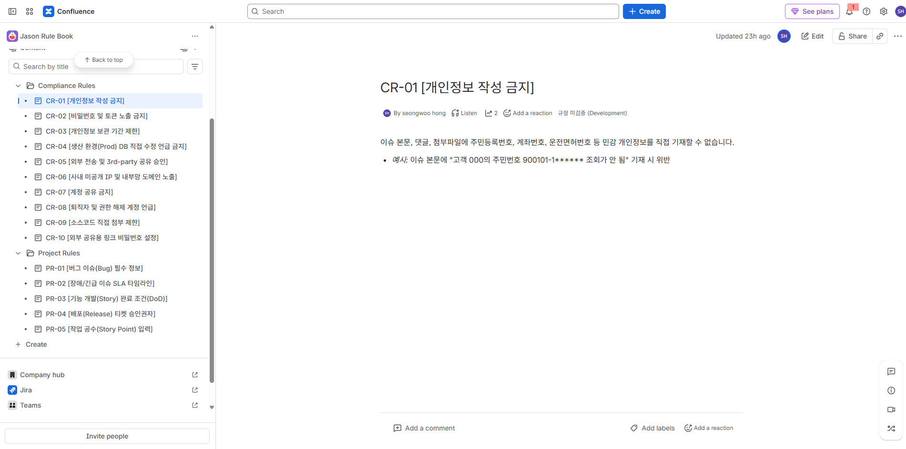
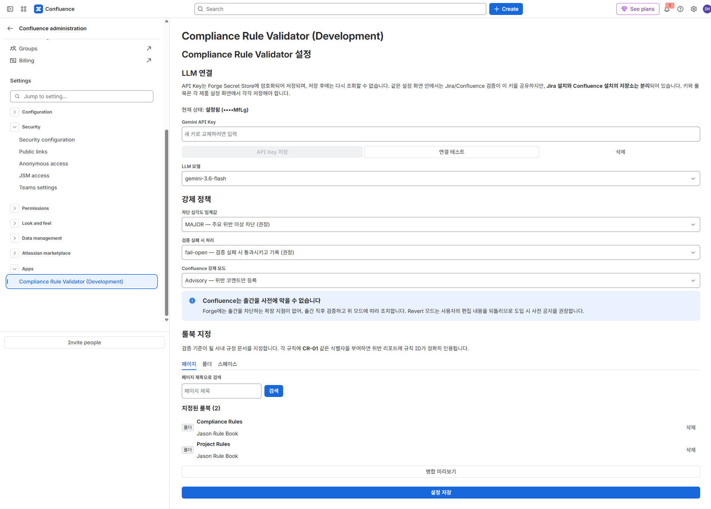
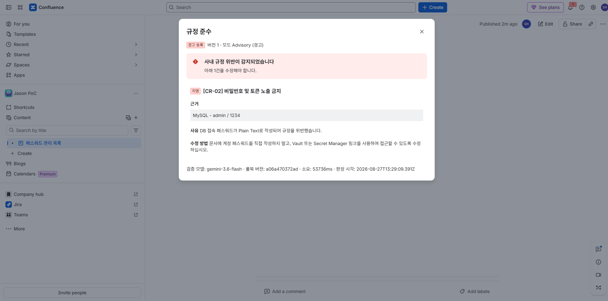
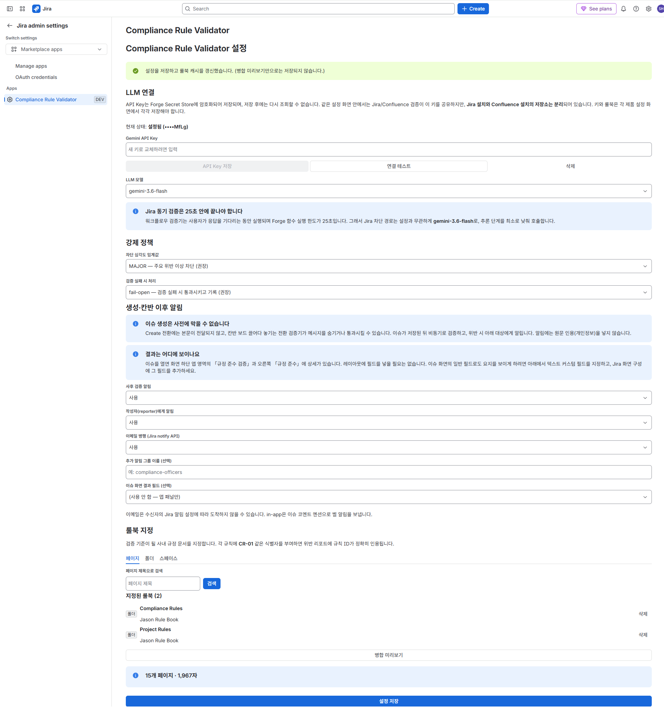
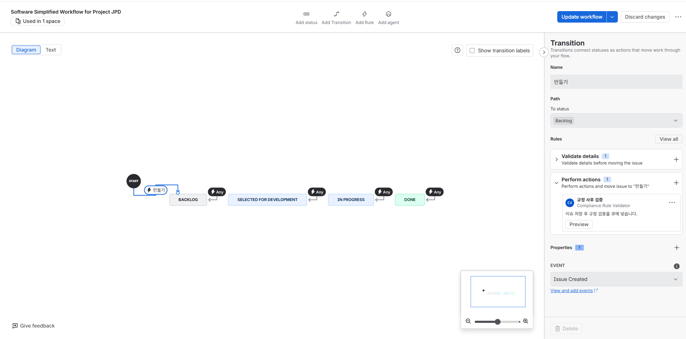
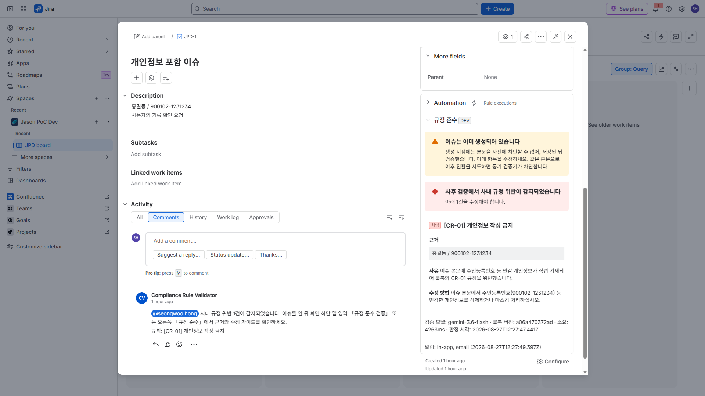

# Compliance Rule Validator

**Atlassian Forge 기반 Jira / Confluence 사내 규정 자동 검증 앱**

Confluence에 이미 존재하는 사내 규정 문서를 그대로 "검증 기준"으로 삼아, 구성원이 Jira 이슈를 전환하거나 Confluence 문서를 출간하는 순간 LLM이 규정 위반 여부를 판정하고, 위반 시 전환을 차단하거나 출간을 되돌립니다. Jira 이슈 **생성**은 플랫폼이 본문을 사전 검증기에 넘기지 않아 원천 차단할 수 없으므로, 저장 직후 비동기로 검증하고 알립니다 (→ 3.2, 5.4).

---

## 1. 프로젝트 선정 사유 — IT 거버넌스의 이행을 시스템에 반영

대부분의 조직에서 IT 거버넌스는 **문서로는 완비되어 있지만 시스템에는 반영되어 있지 않습니다.** 정보보호 지침, 개인정보 처리 규정, 프로젝트 산출물 표준은 Confluence 어딘가에 잘 정리되어 있고, 연 1회 교육과 감사를 통해 전파됩니다. 그러나 실제 업무가 일어나는 지점, 즉 Jira 이슈를 쓰고 Confluence 문서를 출간하는 그 순간에는 규정을 확인해 줄 장치가 없습니다.

그 결과 거버넌스 이행은 세 가지 방식으로만 작동합니다.

- **사람의 기억에 의존**: 구성원이 규정을 기억하고 스스로 지키기를 기대합니다.
- **사후 감사에 의존**: 이미 유출되거나 잘못 기록된 뒤에 발견합니다. 시정 비용이 가장 큰 시점입니다.
- **검토자 병목에 의존**: 리뷰어가 모든 산출물을 읽고 규정 위반을 걸러내야 합니다. 확장되지 않습니다.

이 프로젝트는 **거버넌스 규정을 실행 가능한 통제(Control)로 전환**하는 것을 목표로 합니다. 규정 문서를 코드나 별도 룰 엔진으로 옮겨 적는 것이 아니라, **Confluence에 있는 규정 문서 자체를 판정 기준으로 사용**한다는 점이 핵심입니다. 규정을 개정하면 통제도 함께 개정됩니다. 규정과 통제 사이의 동기화 비용이 0이 되는 지점에서, 거버넌스는 문서가 아니라 시스템의 동작이 됩니다.

## 2. 해결하고자 한 문제 — LLM으로 규정 준수를 업무 흐름에 삽입


### 2.1 문제

기존 자동화 수단으로는 사내 규정을 검사할 수 없습니다. 규정은 **자연어로 쓰인 맥락 판단**을 요구하기 때문입니다.

- "고객 개인정보를 이슈 본문에 직접 기재하지 말 것" — 정규식으로 주민번호 패턴은 잡아도, `김OO 고객님이 010-으로 시작하는 번호로 문의` 같은 우회 표현은 잡지 못합니다.
- "장애 보고서에는 근본 원인과 재발 방지 대책을 반드시 포함할 것" — 문서에 해당 섹션이 있는지가 아니라, **내용이 실질적으로 채워졌는지**를 판단해야 합니다.
- "외부 공개 문서에는 내부 시스템 호스트명을 노출하지 말 것" — 무엇이 내부 시스템인지는 조직 고유의 지식입니다.

Jira Automation의 조건식이나 워크플로우 검증기로는 이런 판단을 표현할 수 없습니다. 결국 사람이 읽어야 하는 영역으로 남습니다.

### 2.2 접근

LLM은 이 지점에 정확히 들어맞습니다. 자연어 규정을 판정 기준으로 받아들이고, 자연어 산출물에 대해 근거를 들어 판정할 수 있습니다. 다만 그대로 쓰면 규정 준수 시스템으로서는 신뢰할 수 없기 때문에, 다음 세 가지를 설계에 못박았습니다.

1. **근거 강제**: 모든 위반 판정은 `규칙 ID + 원문 인용(evidence) + 위반 사유 + 수정 가이드`를 반드시 포함합니다. 근거 없는 "위반입니다"는 사용자를 설득하지 못하고, 거버넌스 통제로서 감사에도 사용할 수 없습니다.
2. **환각 억제**: 시스템 프롬프트에 *"룰북에 명시되지 않은 내용은 위반으로 판정하지 말 것"* 을 최상위 제약으로 두고, 구조화 출력(Structured Output)으로 응답 형태를 고정하며, *"같은 입력에는 같은 판정을 내리고 룰북 문구를 넘어선 해석을 하지 말 것"* 을 지시로 명시합니다. Gemini 3.x가 `temperature` 계열 파라미터를 폐기해 수치로 결정성을 고정할 수단이 사라졌기 때문에, 판정 일관성은 프롬프트 제약과 응답 스키마, 그리고 사후 검증 코드로 확보합니다. 완전한 재현성은 보장되지 않으므로 판정 결과에 모델명과 룰북 해시를 함께 기록해 추적 가능성을 남깁니다.
3. **차단 강도의 단계적 조절**: LLM 판정으로 사용자의 작업을 잃게 만드는 것은 위험합니다. 그래서 강제 수준을 관리자가 선택하게 했습니다 (아래 3.3).

목표는 규정을 **강제**하는 것이면서 동시에 **유도**하는 것입니다. 차단 메시지가 "규정 위반"으로 끝나면 사용자는 우회를 학습합니다. 어떤 규칙의 어느 문장 때문에 걸렸고 어떻게 고치면 되는지를 그 자리에서 알려주면, 사용자는 규정을 학습합니다.

## 3. 주요 기능


### 3.1 Confluence 룰북 매핑

검증 기준이 될 규정 문서를 Confluence에서 직접 지정합니다.

- **페이지 / 폴더 / 스페이스** 세 가지 단위로 선택, 복수 지정 지원
  - Confluence Cloud의 폴더는 페이지와 별개의 독립 콘텐츠 타입이므로, 폴더 전용 API로 하위 페이지를 순회합니다. 규정 문서를 폴더로 묶어 관리하는 조직을 그대로 지원하기 위한 것입니다.
- 페이지 선택 시 **하위 트리 포함** 옵션 제공 (규정이 여러 하위 문서로 나뉜 경우 대응)
- 트리 탐색 UI 대신 **검색 + 선택 목록 누적** 방식. 검색 결과에 각 항목의 경로(조상 제목 체인)를 함께 표시해 동명 문서를 구분
- 저장 전 **병합 미리보기**로 총 문자 수와 포함 페이지 수를 표시해, 프롬프트 상한(60,000자) 초과를 사전에 확인
- 지정된 룰북은 본문을 추출·정규화·병합하여 캐시하고, 병합 결과의 SHA-256 해시를 판정 기록에 함께 남겨 **어느 시점 규정으로 판정했는지** 추적 가능


### 3.2 Jira — 동기 차단과 사후 탐지

`jira:workflowValidator` 모듈을 사용해 이슈 **전환**을 **실제로 차단**합니다. 이슈 상세에서 전환을 실행하는 순간 검증이 수행되며, 위반이 감지되면 대상 상태로 진행되지 않습니다.

- 워크플로우 전환에 검증기를 **수동 등록** (앱 설치만으로는 적용되지 않음). **Create가 아니라 이슈가 이미 있는 전환**에 등록
- 차단 시 오류 메시지에 위반 요약 노출
- 전체 위반 내역(규칙 ID, 근거, 수정 가이드)은 **이슈 패널**에서 상시 열람. 프로젝트 Browse만 있는 게스트·익명도 패널 상세를 볼 수 있습니다
- 심각도 임계값 설정: `CRITICAL`만 차단하고 `MINOR`는 넘기는 등의 조절 가능. 패널에는 임계값 이상 위반만 표시합니다

**생성과 칸반 보드**는 사전 차단을 믿을 수 없습니다. Create 전환에는 요약/설명이 검증기로 오지 않고, 칸반 끌어다 놓기는 커스텀 차단 메시지가 숨겨지거나 전환이 통과될 수 있습니다. 그래서 이슈가 저장된 뒤 **워크플로우 후처리**가 비동기 검증을 큐에 넣습니다. (이 사이트에서는 `avi:jira:created:issue` 제품 이벤트가 핸들러까지 오지 않습니다.)

- 위반 시 이슈 패널에 기록하고, 작성자(및 설정한 그룹)에게 **in-app 알림**(코멘트 멘션)을 보냅니다. 이메일은 설정에서 켤 수 있습니다
- 알림 본문에는 원문 인용(개인정보)을 넣지 않습니다. 상세는 패널에만 있습니다
- 같은 본문을 이미 평가했다면 전환 검증기는 LLM 없이 즉시 차단/통과합니다
- 알림은 노출을 닫지 않습니다. 이슈를 격리하는 것은 후속 과제입니다


### 3.3 Confluence — 검증 후 강제 (Detect & Enforce)

Confluence는 출간 자체를 사전 차단할 수 있는 확장 지점이 Forge에 없습니다(→ 6장 참조). 그래서 출간 직후 비동기로 검증하고, 관리자가 선택한 **강제 모드**에 따라 조치합니다.


| 모드           | 동작                             | 용도                         |
| ------------ | ------------------------------ | -------------------------- |
| **Advisory** | 위반 내역을 페이지 코멘트로 등록 + 상태 배지(노랑) | 도입 초기, 인식 제고               |
| **Gate**     | Advisory + 배지(빨강)로 "규정 미준수" 명시 | 감사 추적은 필요하나 작업 손실은 피해야 할 때 |
| **Revert**   | Gate + **직전 규정 준수 버전으로 자동 복원** | 강력 통제                      |


추가로 **출간 전 사전 검증**(`confluence:contentAction`)을 제공해, 사용자가 차단당하기 전에 스스로 규정 위반을 확인할 수 있게 합니다.

### 3.4 LLM 및 API Key 설정

- Jira / Confluence **각각의** 앱 설정 화면에서 LLM Provider·모델·API Key·룰북 설정
- API Key는 **Forge Secret Store**(`kvs.setSecret`)에 암호화 저장. 저장 후에는 조회 API가 마스킹된 존재 여부만 반환하며 평문은 다시 노출되지 않습니다.
- **설치별 저장소 분리**: 같은 사이트에 Jira·Confluence를 각각 설치하면 KVS/Secret이 분리됩니다. 한쪽에만 저장한 키·룰북은 다른 제품 검증기에 보이지 않습니다.
- "연결 테스트" 버튼으로 키 유효성 즉시 확인
- **실패 정책** 선택: LLM 장애·타임아웃 시 `fail-open`(통과 후 미검증 플래그) / `fail-closed`(차단)
- 룰북은 **설정 저장** 시에만 캐시됩니다. 병합 미리보기는 draft만 사용하며 저장하지 않습니다.


### 3.5 감사 로그

모든 판정을 `누가 / 언제 / 무엇을 / 어떤 규칙으로 / 어떻게 판정했는지` 형태로 기록합니다. 거버넌스 통제는 동작하는 것만으로 부족하고, **동작했음을 증명**할 수 있어야 합니다.

## Demo 시연 화면

개발 사이트에서 촬영한 실제 화면입니다. 룰북은 Confluence 스페이스 [Jason Rule Book](https://seongwoohong87.atlassian.net/wiki/spaces/JASONPOLICY)을, 검증 대상은 Jira 프로젝트 [JPD](https://seongwoohong87.atlassian.net/jira/software/c/projects/JPD)를 사용했습니다.

### Confluence

**룰북 설정** — 규정 문서를 Confluence 페이지로 작성합니다. 각 규칙에 `CR-01` 같은 식별자를 부여하면 위반 리포트에 규칙 ID가 정확히 인용됩니다.



**앱 설정** — Confluence 관리 → 앱에서 Gemini API Key, 강제 모드, 룰북을 지정하고 설정을 저장합니다.



**위반 확인 시 화면** — 출간 후 위반이 감지되면 규정 준수 화면에 규칙 ID, 근거, 사유, 수정 방법이 표시됩니다.



### Jira

**앱 설정** — Jira 관리 → 앱에서 LLM, 강제 정책, 생성·칸반 이후 알림, 룰북을 지정합니다. Jira와 Confluence의 저장소는 분리되어 있으므로 양쪽에서 각각 저장해야 합니다.



**워크플로우 사후 검증기 설정** — Create 전환의 Perform actions(작업 수행)에 `규정 사후 검증`을 등록합니다. 앱 설치만으로는 적용되지 않습니다.



**위반 확인 시 화면** — 이슈 생성 후 비동기 검증이 끝나면 이슈 패널과 코멘트로 위반 내역이 표시됩니다.



## 4. 기술 스택 및 구조


### 4.1 기술 스택


| 구분  | 선택                                          | 선정 이유                                                                                |
| --- | ------------------------------------------- | ------------------------------------------------------------------------------------ |
| 플랫폼 | **Atlassian Forge**                         | 앱 코드가 Atlassian 인프라에서 실행되어 별도 서버를 운영·보안할 필요가 없음. 인증·저장소·확장 지점을 플랫폼이 제공               |
| 언어  | **TypeScript 5.x** (`strict`)               | LLM 응답 스키마·이벤트 페이로드·설정 객체의 타입 안정성                                                    |
| 런타임 | **Node.js 22** (`nodejs22.x`)               | Forge 지원 런타임(`nodejs20/22/24.x`) 중 로컬 개발 환경과 맞춘 버전                                   |
| UI  | **Forge UI Kit 2** (`@forge/react`)         | Atlassian 디자인 시스템 자동 적용, 별도 정적 빌드 파이프라인 불필요                                          |
| 저장소 | **Forge KVS + Secret Store** (`@forge/kvs`) | 외부 DB 없이 설정·캐시·판정 결과 저장. API Key는 암호화 저장. **Jira 설치와 Confluence 설치의 KVS는 서로 보이지 않음** |
| LLM | **Google Gemini 3.6 Flash**                 | REST API를 `fetch`로 직접 호출하여 의존성 최소화. 3.6 세대에는 Pro가 없어 Flash 단일 구성                     |


**Runs on Atlassian 대상이 아닙니다.** 이 앱은 판정을 위해 검증 대상 텍스트와 룰북을 Google Gemini API로 전송하므로, 매니페스트의 `permissions.external.fetch.backend`에 외부 도메인을 선언하고 `inScopeEUD: true`로 표시합니다. `forge eligibility`가 `App is egressing data`를 사유로 부적격 판정을 내립니다.

따라서 "데이터가 Atlassian 밖으로 나가지 않는다"고 말할 수는 없습니다. Forge를 택해서 얻는 것은 **자체 서버를 두지 않는다**는 것이며, 데이터 경유 지점은 LLM 제공자 한 곳으로 한정됩니다. 규정 준수 앱으로서 이 경유를 없애려면 Atlassian이 제공하는 LLM API를 쓰거나 사내 추론 서버로 대체해야 하고, 두 방법 모두 PoC 범위를 넘습니다.

### 4.2 아키텍처

Jira와 Confluence는 플랫폼이 제공하는 확장 지점이 다르기 때문에 **서로 다른 실행 경로**를 갖습니다. 이것이 본 시스템 구조의 핵심입니다.

```text
                        ┌─────────────────────────────────┐
                        │      관리자 설정 (UI Kit 2)      │
                        │  룰북 지정 · 모델 · API Key      │
                        │  강제 모드 · 실패 정책           │
                        └───────────────┬─────────────────┘
                                        │
                     ┌──────────────────▼──────────────────┐
                     │ Forge KVS + Secret Store (설치별 분리) │
                     │ Jira 설치 KVS ≠ Confluence 설치 KVS   │
                     │   설정 / 룰북 캐시 / 판정 / 감사로그  │
                     └──────────────────┬──────────────────┘
                                        │
   ═══ 경로 A : Jira ═══                │        ═══ 경로 B : Confluence (비동기) ═══
                                        │
  A-1 이슈 화면 전환 (이슈 키 존재)      │         페이지 출간 (저장 완료)
          │                             │                 │
          ▼                             │                 ▼
  jira:workflowValidator                │      trigger: created/updated:page
  (사용자 대기 · 예산 25초)              │                 │
          │                             │                 ▼
          │◀── 룰북 캐시(제품 설치별) ───┼──────▶  queue → consumer (최대 300초)
          │                             │                 │
  A-2 생성 / 칸반 DnD (저장 후)         │                 │
          │                             │                 │
          ▼                             │                 │
  jira:workflowPostFunction (Create) ───┘                 │
  (+ trigger 예비, 이 사이트에서는 미호출)                  │
          │                                               │
          ▼                                               ▼
   ┌──────────────────────────────────────────────────────────────┐
   │         Gemini 3.6 Flash  ·  Structured Output               │
   │  responseSchema · thinkingLevel minimal · 사후 값 검증        │
   │  → { verdict, violations[{ruleId, evidence, reason, guide}] } │
   └──────────┬───────────────────────────────────┬───────────────┘
              │                                   │
     ┌────────▼────────┐               ┌──────────▼──────────┐
     │ FAIL            │               │ FAIL                │
     │ 전환: 실제 거부  │               │ 모드별 조치:         │
     │ 생성·칸반: 패널  │               │  advisory / gate /  │
     │ + in-app 알림    │               │  revert(버전 복원)  │
     └─────────────────┘               └─────────────────────┘
```


### 4.3 동기 경로의 25초 예산 — 가장 어려웠던 설계 지점

`jira:workflowValidator`는 사용자 주도 호출이므로 Forge 함수 실행 한도가 **25초**입니다. 이 안에 룰북 로딩 + LLM 추론 + 응답 파싱이 모두 끝나야 하고, 초과하면 사용자에게는 알 수 없는 오류로 보입니다. 다음 최적화로 예산을 확보했습니다.

- **룰북 사전 캐싱**: 설정 저장 시점과 일 1회 스케줄 트리거로 룰북을 미리 병합해 KVS에 적재. 검증 시점에는 Confluence API를 호출하지 않고 KVS 1회 읽기로 끝냅니다.
- **모델 강제**: 동기 경로는 설정과 무관하게 `gemini-3.6-flash`로 호출. 지연이 큰 모델이 목록에 추가되더라도 차단 경로가 그것을 집어들지 않도록 강제 지점을 코드에 남겨 둠
- `thinkingLevel: 'minimal'`: 3.6 Flash의 기본 추론 단계는 `medium`이며 그대로 두면 25초 예산을 위협하므로 최소 단계로 고정
- **구조화 출력**: `responseSchema`로 파싱 실패 재시도를 원천 제거
- **입력 상한**: 검증 대상 8,000자 / 룰북 60,000자
- `AbortController` **18초 가드**: 잔여 7초를 응답 처리와 실패 정책 경로에 남겨, 플랫폼 타임아웃 대신 통제된 실패로 전환


## 5. 실행 방법


### 5.1 사전 준비

- Node.js 22 이상, npm 10 이상
- **Atlassian Cloud 개발 사이트** (Jira + Confluence 활성화)
  - Jira에 **회사 관리(Company-managed) 프로젝트**가 최소 1개 필요합니다. `jira:workflowValidator`의 `projectTypes` 기본값이 회사 관리 전용입니다. Free 플랜에서도 `Administer Jira` 전역 권한이 있으면 생성할 수 있으며, 생성 화면의 접힌 메뉴(`더 보기`) 또는 `설정 → 공간 → 공간 만들기`에서 유형을 선택합니다.
- **Gemini API Key** ([Google AI Studio](https://aistudio.google.com/apikey)에서 발급)
- **Developer Space** — 모든 Forge 앱은 Developer Space에 속해야 하며, 없으면 `forge register`가 실패합니다. `forge register`를 대화형 터미널에서 실행하면 그 자리에서 생성할 수 있고, [Developer Console](https://developer.atlassian.com/console)에서 미리 만들어 둘 수도 있습니다. Developer Space를 만들면 같은 이름의 Marketplace 파트너 계정이 함께 생성됩니다.


### 5.2 설치 및 배포

```bash
# 1. Forge CLI 설치 및 로그인 (Forge CLI는 전역 설치 대신 npx로 실행해도 됨)
npm install -g @forge/cli
npx forge login

# 2. 의존성 설치
npm install

# 3. 배포 전 검증 (타입체크 + 매니페스트 참조·모듈 키 유일성)
npm run check

# 4. 앱 등록 (최초 1회, manifest.yml의 app.id 갱신)
#    Developer Space 선택/생성 프롬프트가 나오므로 대화형 터미널에서 실행해야 합니다.
npx forge register

# 5. 매니페스트 검증 (등록 이후에만 동작)
npx forge lint

# 6. 배포 및 설치 (Jira·Confluence 각각)
npx forge deploy -e development
# 스코프 변경으로 메이저가 되면: npx forge deploy -e development --approve MAJOR_VERSION_RULE
npx forge install -e development --site <your-site>.atlassian.net --product Jira
npx forge install -e development --site <your-site>.atlassian.net --product Confluence
# 스코프 추가 후 재배포 시: npx forge install --upgrade ...
# send:notification:jira 가 추가된 버전은 Jira 쪽에서 설치 업그레이드(재동의)가 필요합니다.

# 7. (개발 중) 로컬 코드로 실시간 실행
npx forge tunnel
```

`forge register`는 **최초 1회만** 실행합니다. 두 번 이상 실행하면 새 App ID가 발급되어 기존 환경·저장소·설정값과의 연결이 끊어집니다.

`forge lint`는 Atlassian 로그인과 **유효한** `app.id`**를 함께 요구**합니다. 등록 전 플레이스홀더 상태에서 실행하면 매니페스트를 검사하기도 전에 `Invalid ari string` 오류로 중단되므로, 반드시 `forge register` 이후에 실행해야 합니다. 그래서 로그인·등록 없이도 돌 수 있는 `npm run check`를 함께 제공합니다. 이 스크립트는 매니페스트가 참조하는 함수·리소스 존재 여부, 핸들러 export, **모듈 키 전역 유일성**(consumer와 function이 같은 키를 쓰면 Forge가 거부함)을 검사합니다.

`tsconfig.json`에 `"noEmit": true`를 두면 `tsc --noEmit`는 통과해도 Forge 번들러(`ts-loader`)가 산출물을 만들지 못해 배포가 실패합니다. 타입체크의 `--noEmit`는 npm 스크립트 플래그로 충분하므로 tsconfig에는 두지 않습니다.

### 5.3 앱 설정

1. **룰북 문서 작성**: Confluence에 사내 규정 페이지를 만듭니다. 각 규칙에 `CR-01` 같은 **식별자를 부여**하면 위반 리포트에 규칙 ID가 정확히 인용됩니다.
2. **Confluence 설정**: 설정 → 앱 → *Compliance Rule Validator* 에서
  - Gemini API Key 입력 → **연결 테스트**
  - 모델 선택 (현재 `gemini-3.6-flash` 단일)
  - 룰북 페이지/스페이스 지정 (복수 선택 가능)
  - **강제 모드** 선택 (`advisory` → `gate` → `revert` 순으로 강도 상승)
  - 반드시 **설정 저장** (병합 미리보기만으로는 저장·캐시 갱신이 되지 않음)
3. **Jira 설정**: Jira 관리 → 앱 → *Compliance Rule Validator* 에서 API Key와 룰북, 심각도 임계값, 실패 정책, **생성·칸반 이후 알림**(작성자, 추가 그룹, 이메일 병행, **선택적 결과 필드**)을 지정한 뒤 **설정 저장**
  - Forge KVS는 Jira 설치와 Confluence 설치가 **분리**됩니다. Confluence에서 저장한 룰북/키는 Jira 검증기에 보이지 않으므로, Jira 화면에서도 다시 저장해야 합니다.
  - 상세는 이슈를 열면 **화면 하단 앱 영역 「규정 준수 검증」**과 **오른쪽 「규정 준수」**에 있습니다. 이슈 화면의 일반 필드로도 요지를 보이게 하려면 설정에서 텍스트 커스텀 필드를 고르고, Jira 화면(Screen)에 그 필드를 추가하세요.


### 5.4 Jira 워크플로우 등록 (필수)

Forge 워크플로우 규칙은 **앱 설치만으로 자동 적용되지 않습니다.** 스코프 `manage:jira-configuration`이 추가되면 배포가 메이저가 되고, Jira에서 `forge install --upgrade`로 재동의가 필요합니다.

새 워크플로우 편집기에는 "Post functions"라는 이름이 없습니다.

| 예전 이름 | 새 편집기 | 이 앱에서 고를 이름 |
| --- | --- | --- |
| Validators | **Validate details** (세부 정보 검증) | `Compliance Rule Validator` |
| Post functions | **Perform actions** (작업 수행) | `규정 사후 검증` |

**Create — Perform actions (사후 검증)**

1. Jira 관리 → 이슈 → 워크플로우 → 대상 워크플로우 **편집**
2. **Create** 전환을 선택 → Rules **+** → 왼쪽에서 **Perform actions**
3. **`규정 사후 검증`** 선택. 안내 화면이 뜨면 **Add**
4. `Compliance Rule Validator`를 여기서 고르지 마세요. 그건 검증기라 생성 화면 본문을 받지 못합니다
5. 워크플로우 **게시(Publish)**

목록에 `규정 사후 검증`이 없고 `Compliance Rule Validator`만 있으면, 후처리 모듈이 아직 설치되지 않은 것입니다. 배포·업그레이드 후 워크플로우 편집기를 새로고침하세요.

**이슈가 이미 있는 전환 — Validate details (동기 차단)**

1. → In Progress, → Done 같은 전환을 선택
2. Rules **+** → **Validate details** → `Compliance Rule Validator`
3. 워크플로우 **게시(Publish)**

Create 전환에는 검증기를 붙이지 마세요. 칸반 끌어다 놓기는 차단 메시지가 안 보이거나 전환이 통과될 수 있습니다. 같은 본문은 캐시로 이후 전환에서 즉시 차단됩니다.

### 5.5 동작 확인

- **Jira 전환**: 위반 내용(예: 설명란에 고객 전화번호)이 있는 이슈를 **이미 존재하는 전환**(In Progress 등)으로 넘김 → **전환이 거부**되고 위반 사유가 표시됩니다.
- **Jira 생성**: 같은 위반 내용으로 이슈를 **새로 만듦** → 이슈는 생성되고, 잠시 후 규정 준수 패널에 FAIL이 기록되며 작성자에게 in-app 알림이 갑니다. 알림 본문에는 전화번호가 다시 실리지 않습니다.
- **Confluence**: 위반 내용을 담은 페이지를 출간 → 잠시 후 위반 코멘트와 상태 배지가 나타나고, `revert` 모드에서는 직전 버전으로 복원됩니다.
- **사전 검증**: 페이지 상단 `⋯` 메뉴 → *규정 사전 검증* 으로 출간 전 확인
- **로그**: `npx forge logs -e development` 에서 생성 직후 `[jiraPostFunction] 호출됨` → `[jiraQueue] 적재` → `[complianceConsumer]` → `[jiraAsync]` 순이어야 합니다. `[jiraIssueTrigger]`는 이 사이트에서 안 찍혀도 정상입니다. `[workflowValidator] 호출됨` / `[saveSettings/jira] 룰북 캐시 갱신` 은 전환·설정 경로입니다.


## 6. 구현 범위 / 미구현 범위


### 6.1 구현 범위 (PoC — Phase 1)

- Confluence 룰북 매핑: **페이지·폴더·스페이스** 복수 지정, 하위 트리 포함, 본문 추출·정규화·병합·캐싱
- Gemini API Key의 Secret Store 암호화 저장 및 연결 테스트
- Full-Prompt 방식 LLM 검증 파이프라인 (구조화 출력, 근거 강제, 응답 값 사후 검증)
- **Jira 동기 차단**: `jira:workflowValidator` 기반 전환 차단(이슈 키 존재 전환에 등록), 25초 예산 최적화, 심각도 임계값, 본문 해시 캐시
- **Jira 사후 탐지**: Create 후처리 → 비동기 검증 → 이슈 패널 기록 + in-app 알림(선택적 email). 알림에 원문 인용 없음
- **Confluence 사후 강제**: 이벤트 트리거 → 비동기 큐 검증 → 3단계 강제 모드(복원 포함)
- 위반 상세 노출 UI: Jira 이슈 패널, Confluence 바이라인 배지 및 상세 모달
- 출간 전 온디맨드 사전 검증
- 실패 정책(`fail-open` / `fail-closed`) 및 감사 로그


### 6.2 미구현 범위 (의도적 제외)


| 항목                             | 제외 사유                                                                                                                    |
| ------------------------------ | ------------------------------------------------------------------------------------------------------------------------ |
| **RAG / Vector DB**            | `plan.md` 5.2의 Phase 2 항목. PoC에서는 Full-Prompt로 판정 품질을 먼저 검증하는 것이 목적. 룰북 60,000자 상한으로 대응                                  |
| **Multi-LLM (OpenAI, Claude)** | `plan.md` 2.4에 따라 Gemini로 제한. 추상화 계층(`services/llm/`)은 분리해 두어 확장 지점만 확보                                                  |
| **예외 승인(Bypass) 워크플로우**        | Phase 2 항목. 승인자 지정·알림·감사 연계까지 필요해 PoC 범위를 초과                                                                             |
| **프로젝트/스페이스별 설정**              | PoC는 사이트 전역 설정으로 충분. 다만 나중에 재작업이 없도록, 설정 조회를 `resolveSettings(product, scopeId?)` 형태로 두어 **범위별 설정 → 전역 설정 폴백** 구조만 미리 확보 |
| **이슈 유형별 검증 대상 필드**            | PoC는 요약 + 설명 고정. 대상 텍스트 수집을 `collectJiraTargetText()`로 분리해, 필드 목록을 주입받는 구조로 바꿀 때 **호출부와 프롬프트 로직을 건드리지 않도록** 설계           |
| **트리 탐색 방식 룰북 선택기**            | 검색 + 경로 표시로 동명 문서 구분이 가능해 트리 UI는 비용 대비 효용이 낮다고 판단                                                                        |
| **Confluence 출간 원천 차단**        | **플랫폼 제약.** 출간 차단 모듈(`publishConditions`)은 Connect 전용이며, Connect 하이브리드는 기존 마켓플레이스 등재 앱만 채택 가능. 사후 강제 모드로 대체              |
| **백엔드에서 모달 강제 노출**             | **플랫폼 제약.** Forge에는 서버에서 사용자 화면에 모달을 띄우는 API가 없음. 워크플로우 오류 메시지 + 상시 노출 패널/배지로 대체                                         |
| **팀 관리 프로젝트 지원**               | PoC는 `projectTypes: ['company-managed']`로 한정. Forge 문서상 `team-managed`도 선언 가능하나 미검증                                      |
| **Jira Create 시점 원천 차단**     | **플랫폼 제약.** Create에서 생성 화면 본문을 람다가 받지 못함. 생성 후 비동기 검증·알림으로 보완. 이슈 격리는 후속 |
| **칸반 DnD 커스텀 차단 메시지**     | **플랫폼 제약.** Enhanced Board는 validator 오류를 숨기거나 일반 문구로 바꿈. Create 후처리 + 이후 전환 검증기로 보완 |
| **Jira 위반 이슈 격리**            | Phase 2. 알림만으로는 Browse 노출이 닫히지 않음. 이슈 보안 레벨 → (옵션) 격리 프로젝트 이동 |
| **첨부파일·이미지 내 규정 검증**           | 멀티모달 검증은 지연과 비용이 커 PoC 범위 외                                                                                              |
| **다국어 판정**                     | 프롬프트는 한국어 규정을 전제. i18n 미적용                                                                                               |


> `plan.md`와 실제 구현이 달라진 항목과 배포 검증에서 확정된 플랫폼 한계의 상세 근거는 `spec.md` [9장](./spec.md)에 정리되어 있습니다.


## 7. 개선 방향


### 7.1 RAG 전환 (Phase 2 — 가장 시급)

Full-Prompt 방식은 룰북 분량에 정비례해 지연과 비용이 증가하며, 25초 예산에 직접 부딪힙니다. 실제 사내 규정은 수백 페이지 규모이므로 다음 전환이 필요합니다.

- 룰북을 규칙 단위로 청킹 → 임베딩 → Vector DB(Pinecone, Qdrant) 적재
- 검증 시 대상 텍스트와 **의미적으로 관련된 규칙만 검색**해 프롬프트 구성
- 기대 효과: 토큰 비용 절감, 지연 감소로 25초 예산 여유 확보, 룰북 규모 제약 해소


### 7.2 판정 품질 관리

현재 판정 품질을 측정하는 수단이 없다는 것이 가장 큰 약점입니다.

- 위반/준수 케이스로 구성된 **골든 데이터셋**과 회귀 테스트 파이프라인 구축
- 사용자 피드백 루프: 오탐(False Positive) 신고 버튼 → 프롬프트 및 룰북 문구 개선에 반영
- 규칙별 오탐율 대시보드로 **모호하게 작성된 규정 자체를 식별** (규정 품질 개선으로 환류)


### 7.3 적용 범위의 세분화

PoC는 사이트 전역 단일 설정으로 동작합니다. 실제 조직에서는 규정 적용 단위가 더 잘게 나뉩니다.

**프로젝트/스페이스별 설정** — 프로젝트나 스페이스마다 적용 규정이 다를 수 있습니다. `jira:projectSettingsPage`와 `confluence:spaceSettings` 모듈을 추가하고, 설정 해석을 **범위별 → 전역 → 기본값** 우선순위로 확장합니다. 룰북 목록·강제 모드·심각도 임계값은 범위별로 재정의하되, API Key와 모델은 비용과 키 관리를 분산시키지 않기 위해 전역으로 유지합니다.

**이슈 유형별 검증 대상 필드** — 이슈 유형에 따라 검증해야 할 필드가 달라집니다. "장애 보고"는 근본 원인·재발 방지 대책 필드가, "변경 요청"은 영향도·롤백 계획 필드가 규정 검증 대상이어야 합니다. 이슈 유형별 필드 매핑과, 커스텀 필드 값 타입별(선택 목록·사용자·날짜·ADF 리치 텍스트) 평문 변환기가 필요합니다. 다만 필드가 늘어나면 프롬프트도 길어지므로 25초 예산 재검토가 동반되어야 하며, 이는 7.1의 RAG 전환과 함께 진행하는 것이 합리적입니다.

두 항목 모두 **PoC 코드에 확장 지점을 미리 남겨 두었습니다**(6.2 참조). 나중에 도입할 때 저장 스키마 변경이나 호출부 수정이 발생하지 않도록 한 것입니다.

### 7.4 예외 승인 워크플로우

정당한 예외는 반드시 존재합니다. 우회 경로가 없는 통제는 결국 무력화되므로, 보안팀 승인 기반의 Bypass 요청 흐름과 승인 이력 감사 추적이 필요합니다.

### 7.5 비용 및 성능 통제

- 대상 텍스트 해시 기반 판정 캐시로 중복 호출 제거 (오타 수정 등 사소한 재저장 대응)
- 룰북과 무관한 변경(라벨, 담당자 변경 등)은 LLM 호출 없이 조기 반환
- 설치 단위 월간 토큰 예산 및 사용량 리포트


### 7.6 통제 범위 확대

- Bitbucket PR 설명·커밋 메시지 검증으로 SDLC 전 구간 확대
- Rovo 에이전트 연동: 작성 중 대화형 규정 코칭 ("이 문서, 규정에 맞나요?")
- 조직 단위 준수율 리포트로 거버넌스 KPI 계량화


## 8. AI 활용 방식


### 8.1 제품 내 AI 활용 — 판정자로서의 LLM

LLM을 "문장을 생성하는 도구"가 아니라 **근거를 제시하는 판정자**로 사용합니다. 자연어로 쓰인 규정을 판정 기준으로 직접 입력받아, 자연어 산출물의 위반 여부를 규칙 ID와 원문 인용으로 판정합니다.

**입력 구성 (Full-Prompt, PoC)**

- System Instruction — 사내 규정 감사관 페르소나. 최상위 제약으로 *"룰북에 명시되지 않은 내용은 위반으로 판정하지 말 것"*, *"모든 위반에 규칙 ID와 원문 인용을 포함할 것"*, *"모호한 경우 MINOR로 분류하고 차단하지 말 것"* 을 명시
- User Content — `<RULEBOOK>` 병합된 규정 전문 `</RULEBOOK>` + `<TARGET>` 검증 대상 텍스트 `</TARGET>`

**출력 통제**

```jsonc
{
  "verdict": "PASS | FAIL",
  "violations": [{
    "ruleId":    "CR-03",                        // 어떤 규칙인지
    "ruleTitle": "개인정보 보관 기간 초과",
    "severity":  "CRITICAL",
    "evidence":  "...위반으로 판단된 원문 인용...",  // 왜 그렇게 봤는지
    "reason":    "...규정 위반 근거 설명...",
    "guideline": "...이렇게 고치세요..."           // 어떻게 고칠지
  }]
}
```

**신뢰성 확보 장치**


| 장치                                   | 목적                                                                              |
| ------------------------------------ | ------------------------------------------------------------------------------- |
| `responseSchema` (Structured Output) | 자유 서술 제거, 파싱 실패 및 재시도 제거                                                        |
| 프롬프트의 일관성 지시                         | *"같은 입력에는 같은 판정"*, *"룰북 문구를 넘어선 해석 금지"* 를 시스템 지시로 명시                            |
| 근거(`evidence`) 필수                    | 인용 없는 판정을 구조적으로 불가능하게 만들어 환각 억제                                                 |
| 응답 값 사후 검증                           | 스키마를 지정했더라도 `ruleId`·`evidence`가 빈 항목은 코드에서 버리고, `verdict`도 실제 남은 위반 목록으로 다시 계산 |
| `model` · `rulebookHash` 기록          | 어느 모델과 어느 시점의 규정으로 판정했는지 추적                                                     |
| 실패 정책                                | LLM 장애가 업무 중단으로 번지지 않도록 `fail-open` 기본. 고규제 환경은 `fail-closed` 선택                |


**판정 재현성은 보장되지 않습니다.** 원래 설계는 `temperature: 0`으로 동일 입력에 동일 판정을 고정하려 했으나, Gemini 3.x가 `temperature`·`top_p`·`top_k`를 폐기했습니다(보내면 무시되고 향후 세대에서는 `400`). 수치로 결정성을 고정할 수단이 API에서 사라진 것이므로, 남겨두면 동작하지 않는 설정을 동작한다고 믿는 상태가 됩니다. Google이 제시한 대체 수단이 "시스템 지시 + 구조화 출력"이라 그 두 가지를 강화하고, 감사 추적은 **재현이 아니라 기록**으로 확보했습니다. 판정마다 모델명·룰북 해시·근거 인용이 남으므로 사후에 판정 근거를 검토할 수는 있지만, 동일 입력을 다시 넣어 같은 결과가 나온다는 보장은 없습니다.

즉 **LLM은 판정하고, 강제는 플랫폼이 담당합니다.** LLM 응답은 항상 구조화된 데이터로 환원되며, 차단·복원·기록은 결정론적인 Forge 코드가 수행합니다. LLM의 비결정성이 통제 로직으로 전파되지 않도록 경계를 분리했습니다.

### 8.2 개발 과정의 AI 활용 — 검증 도구로서의 AI

개발에는 Cursor(Claude)를 사용했으며, **코드 생성보다 명세 검증에 더 큰 가치**가 있었습니다.

**플랫폼 제약 검증**: 기획 명세를 그대로 구현하려다 실패하는 것을 막기 위해, 착수 전 각 요구사항을 Forge 공식 문서·개발자 커뮤니티와 교차 검증했습니다. 그 결과 착수 전에 **명세상 치명적 문제 6건**을 발견했습니다.


| 발견 사항                                                                 | 조치                                                           |
| --------------------------------------------------------------------- | ------------------------------------------------------------ |
| 제품 이벤트는 저장 **후** 비동기 발생 → 이벤트로는 차단 불가                                 | Jira를 `jira:workflowValidator` 기반 동기 차단으로 재설계                |
| Confluence 출간 차단 모듈은 **Connect 전용**                                   | 3단계 강제 모드(advisory/gate/revert)로 대체 설계                       |
| `avi:confluence:published:page`는 출간이 아니라 **라이브 문서→페이지 전환** 이벤트        | `created:page` / `updated:page`로 정정                          |
| `workflowValidator`는 55초가 아니라 **25초** 한도 (사용자 주도 호출)                  | 룰북 사전 캐싱 + Flash 강제 + 추론 단계 최소화 + 18초 가드 설계                  |
| `gemini-1.5-*`는 지원 종료 모델                                              | `gemini-3.6-flash`로 대체 (배포 검증 중 2.5 계열도 신규 사용자 차단이 확인되어 재정정) |
| 명세는 폴더를 "Space/Parent Page"와 등치했으나, 폴더는 전용 API와 스코프를 가진 **독립 콘텐츠 타입** | 선택 타입을 page/folder/space 셋으로 분리하고 수집 경로를 각각 구현               |


이 중 대부분은 코드를 작성한 뒤에야 발견했다면 아키텍처 전면 재작업으로 이어졌을 항목입니다. AI를 코드 작성 단계가 아니라 **설계 검증 단계에 먼저 투입한 것이 가장 효과가 컸던 판단**입니다.

구현 단계와 배포 검증에서 추가로 확인한 함정입니다.

- `modifiedFields`**에** `summary` **없음** → 요약은 REST, 설명은 `modifiedFields`로 덮는 병합. Create에서는 이슈 키도 `modifiedFields`도 비어 사전 차단 불가. 생성 후 워크플로우 후처리로 사후 검증·알림. 이 사이트에서는 `created:issue` 제품 이벤트가 핸들러를 호출하지 않음.
- `revert` **루프** → `selfGenerated` + 복원 버전 표시로 이중 차단.
- **KVS 설치 분리** → Jira/Confluence 각각 설치 시 설정·시크릿·룰북 캐시가 공유되지 않음. 양쪽 설정 화면에서 각각 저장 필요.
- **룰북 검색은** `asApp` → `asUser`는 동의 전 `Authentication Required`가 나고, 리졸버 `catch`가 Forge 동의 프롬프트까지 가로채 검색이 실패함. 수집도 `asApp`이므로 검색과 일치시킴.
- **Confluence v2 + 스코프** → v2는 granular 필요. 클래식만으로는 `401 scope does not match`. 클래식은 유지한 채 granular를 **추가만** 함(ECO-1292: 클래식 제거 금지).
- **모듈 키 전역 유일** → `consumer`와 `function`이 같은 키(`compliance-consumer`)를 쓰면 배포 거부. 함수 키를 `compliance-consumer-fn`으로 분리.
- **egress 형식** → `fetch.backend` 문자열 축약형은 deprecated. `address` + `inScopeEUD` 객체 사용. Runs on Atlassian 부적격(`App is egressing data`).

**그 외 활용**: Forge 모듈 조합 탐색과 대안 비교(`uiModifications` vs `workflowValidator`), 25초 예산 최적화 아이디어 도출, 반복적인 타입 정의와 UI Kit 2 컴포넌트 작성, README·명세 문서 초안 작성.

**AI에 위임하지 않은 것**: 강제 모드의 단계 구분, 실패 정책의 기본값(`fail-open`), 심각도 임계값 도입 여부 등 **제품의 위험 감수 수준을 결정하는 판단**은 직접 결정했습니다. "차단할 것인가 경고할 것인가"는 기술 문제가 아니라 조직이 감당할 수 있는 마찰의 크기에 관한 문제이기 때문입니다.

---


## 참고 문서


| 문서                     | 내용                                       |
| ---------------------- | ---------------------------------------- |
| `[plan.md](./plan.md)` | 원본 제품 기획 명세 (수정 없이 보존)                   |
| `[spec.md](./spec.md)` | 개발 환경·아키텍처·데이터 모델·API·마일스톤 및 기획 대비 변경 근거 |


